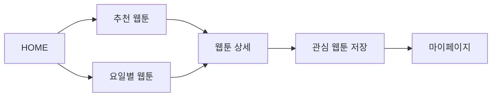
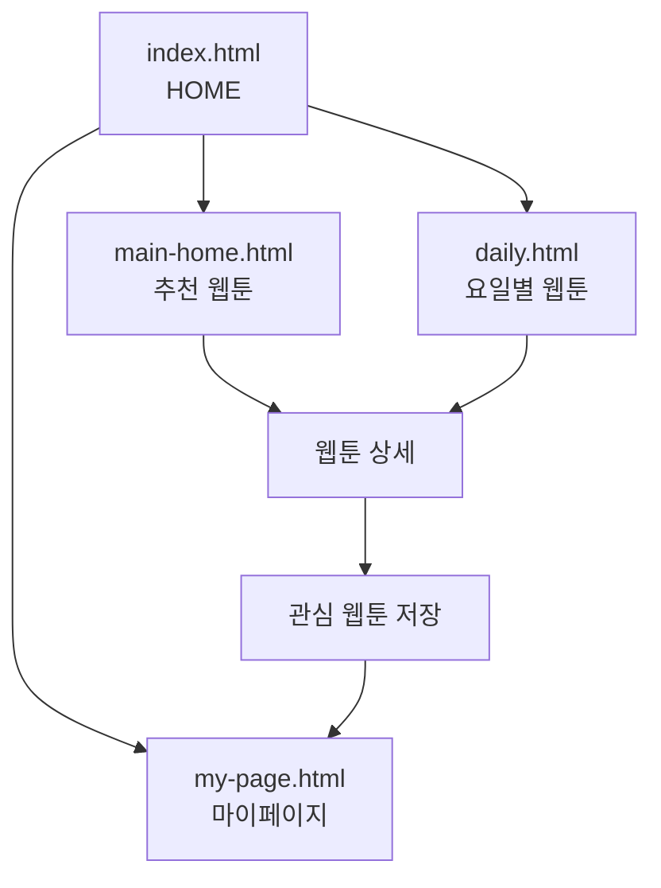
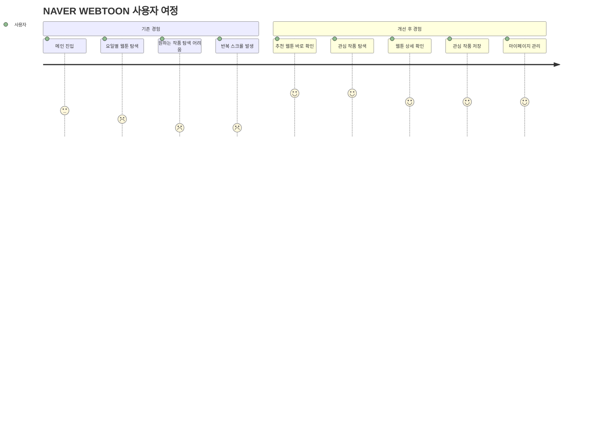
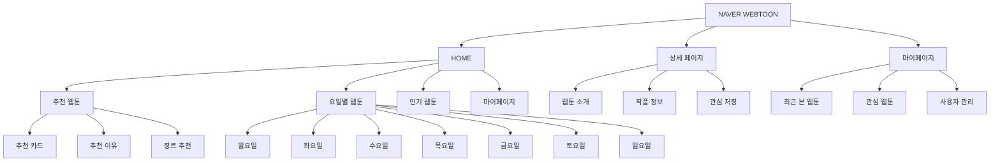
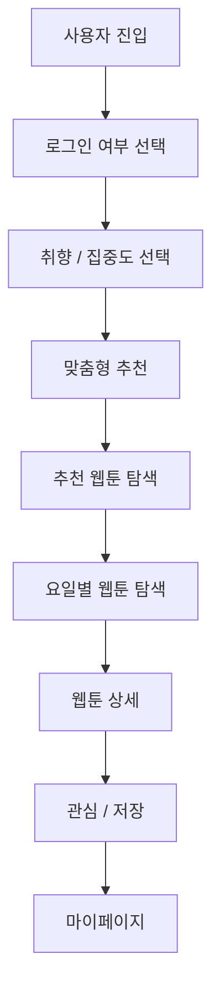
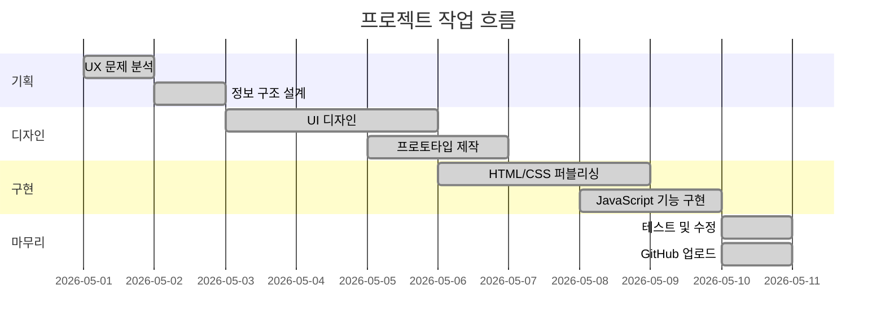
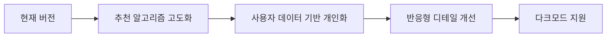

# 🍀 NAVER WEBTOON UX Renewal

기존 네이버 웹툰 서비스의 탐색 구조를 개선하여  
**사용자가 더 빠르게 원하는 웹툰을 발견하고 탐색할 수 있도록 리디자인한 UIUX 프로젝트**입니다.

> 사용자는 추천 웹툰을 먼저 확인하고, 요일별 웹툰 탐색과 마이페이지 기능을 통해 보다 직관적으로 콘텐츠를 탐색할 수 있습니다.

---

# 프로젝트 링크

| 구분             | 링크                                                                                     |
| ---------------- | ---------------------------------------------------------------------------------------- |
| GitHub           | https://github.com/yujj9705/naver-webtoon.git                                            |
| Notion 기획 문서 | https://bolder-shingle-eec.notion.site/35f65522b1d8801c8365f16c5077d8d6?source=copy_link |

---

# 프로젝트 개요

| 항목       | 내용                                           |
| ---------- | ---------------------------------------------- |
| 프로젝트명 | NAVER WEBTOON UX Renewal                       |
| 유형       | 웹툰 플랫폼 UX/UI 리디자인                     |
| 핵심 목표  | 추천 웹툰 접근성 향상 및 탐색 흐름 개선        |
| 주요 기능  | 추천 웹툰, 요일별 웹툰, 상세페이지, 마이페이지 |
| 제작 방식  | HTML, CSS, JavaScript                          |
| 디자인 툴  | Figma, Photoshop                               |
| 배포       | GitHub Pages                                   |

---

# 핵심 기능

| 기능           | 설명                                   |
| -------------- | -------------------------------------- |
| 추천 웹툰      | 사용자 관심 기반 추천 콘텐츠 우선 제공 |
| 요일별 웹툰    | 요일 기준 웹툰 탐색 기능               |
| 마이페이지     | 쿠키 설정 및 취향 파악, 최근 본 작품및 저장 목록 확인  |

---

# 서비스 흐름



---

# 화면 구조



---

# 사용자 여정



---

# 정보 구조도 (Information Architecture)



---

# UX 개선 방향

| 기존 문제             | 개선 방향                  |
| --------------------- | -------------------------- |
| 추천 웹툰 접근 어려움 | 추천 콘텐츠 상단 우선 배치 |
| 요일 중심 단순 탐색   | 추천 + 요일 구조 분리      |
| 반복적인 탐색 흐름    | 관심 웹툰 저장 기능 추가   |
| 개인화 경험 부족      | 마이페이지 UX 개선         |

---

# 디자인 방향

| 구분       | 내용                                   |
| ---------- | -------------------------------------- |
| KEYWORD    | Personalized / Clear / Content Focused |
| COLOR      | 네이버 브랜드 컬러 기반                |
| UI         | 카드형 UI 및 콘텐츠 중심 레이아웃      |
| UX         | 탐색 피로 최소화 및 접근성 강화        |
| RESPONSIVE | 모바일 중심 반응형 구조                |

---

# 기술 스택

### Frontend


### Tools


---

# 주요 구현 포인트

| 구분        | 구현 내용                            |
| ----------- | ------------------------------------ |
| UI 구조     | 추천 / 요일별 / 마이페이지 흐름 구성 |
| 스타일링    | 카드형 UI 기반 반응형 디자인         |
| 인터랙션    | 저장 기능 및 탐색 흐름 구현          |
| UX 개선     | 추천 콘텐츠 우선 배치                |
| 콘텐츠 흐름 | 사용자 탐색 단계 최소화              |

---

# 상태 흐름 구조



---

# 폴더 구조

```text
naver-webtoon
├── assets
├── css
├── js
├── images
├── index.html
├── onboarding.html
├── signup.html
├── login.html
├── login-naver.html
├── main-home.html
├── daily.html
├── my-page.html
└── README.md
```

---

# 페이지별 역할

| 페이지             | 역할                       |
| ------------------ | -------------------------- |
| `index.html`       | Splash & Login             |
| `signup.html`      | 회원가입 페이지            |
| `login.html`       | 로그인 페이지              |
| `login-naver.html` | 간편 로그인 네이버         |
| `onboarding.html`  | 장르 및 집중도 선택 온보딩 |
| `main-home.html`   | 추천 웹툰 화면             |
| `daily.html`       | 요일별 웹툰 탐색           |
| `my-page.html`     | 마이페이지                 |

---

# 작업 과정



---

# 프로젝트에서 신경 쓴 부분

| 관점        | 내용                       |
| ----------- | -------------------------- |
| UX          | 추천 콘텐츠 접근 흐름 개선 |
| UI          | 콘텐츠 중심 카드형 UI 구성 |
| Navigation  | 정보 구조 단순화           |
| Interaction | 저장 및 탐색 인터랙션 강화 |
| Portfolio   | 기획 → UX → 구현 흐름 정리 |

---

# 개선 예정



| 개선 항목   | 방향                        |
| ----------- | --------------------------- |
| 추천 기능   | 사용자 취향 기반 추천 강화  |
| 데이터 관리 | 사용자별 저장 데이터 관리   |
| UI 개선     | 애니메이션 및 인터랙션 강화 |
| 접근성      | 웹 접근성 및 사용성 개선    |
| 포트폴리오  | 디자인 시스템 정리 추가     |

---

# 프로젝트 의의

이 프로젝트는 단순한 웹툰 UI 제작이 아닌,  
사용자가 콘텐츠를 탐색하는 흐름 자체를 개선하는 데 초점을 둔 UX 리디자인 프로젝트입니다.

특히 추천 콘텐츠 접근성과 정보 구조를 재설계하여  
사용자가 더 빠르게 원하는 웹툰을 발견하고 저장할 수 있도록 UX 흐름을 개선하였습니다.

---

# 제작자

| 구분   | 내용                          |
| ------ | ----------------------------- |
| 이름   | 최유정/Yujeong Choi           |
| 역할   | UIUX 설계, 웹디자인, 퍼블리싱 |
| GitHub | https://github.com/yujj9705   |
